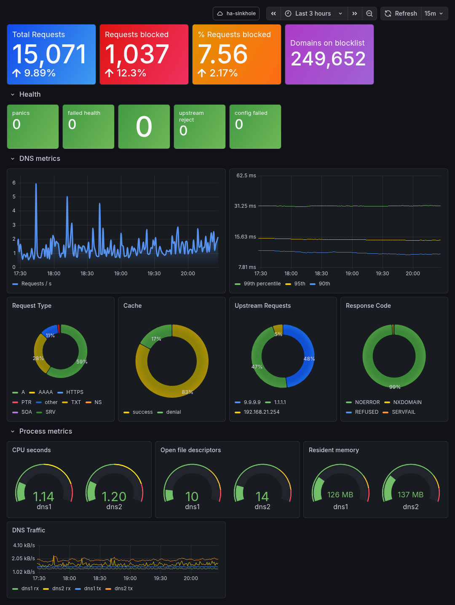

# Stats Collector

The `stats-collector` container is responsible for pushing logs and metrics from the [dns-resolver](../dns-resolver/README.md) container on the same host to the local or cloud based metrics and visualisation stack. It's based on [grafana alloy](https://grafana.com/docs/alloy/latest/)



The [dashboard](../.files/grafana-dashboard.json) can be imported from this repo.

## Usage

   ```bash
   systemctl --user (start|stop|restart) stats-collector
   ```

## Configuration

The `stats-collector` can push to a local stack that you installed as part of `ha-sinkhole` or to a cloud based grafana stack that you already have. [Grafana](https://grafana.com/) offer a generous and actually useful free tier with more than enough capacity to show deep metric visualisation with 14 day retention if you're happy for them to host your data.

### Cloud Metrics

The following 3 configuration items are needed in your inventory in order to push your metrics to a grafana cloud stack. Creating the stack is beyond the scope of this doc, the assumption is that you already have one setup and ready to go.

```yaml
    dns-resolvers:
      vars:
        prometheus_endpoint: https://prometheus-prod-NN-prod-eu-west-1.grafana.net/api/prom/push
        prometheus_user: 1234567
        prometheus_api_token: glc_eyJvIjoiDPU5M...UAd2rzdd4yIn12
```

To find the first two values, log in to your grafana UI with an admin account and open **Connections > Data sources** and select your prometheus service (on the free tier it will be named `grafanacloud-yourusername-prom`). The URL you need is in the `Connection` section, labeled `Prometheus server URL`. Copy the entire value into the `prometheus_endpoint` config item in your inventory as shown above.

The value of the `prometheus_user` is in the section below named `Authentication`, it's labeled `User` and will be a 6-8 digit integer.

Obtaining the API token needs some work 😅

1. Still in the grafana UI, go to **Administration > Users and access > Cloud access policies**
2. Click on the **Create access policy** button
3. Name it something like `Write logs and metrics` / `write-logs-and-metrics` in the 2 fields
4. In the **Scopes** section, tick the `Write` checkbox for `metrics` and `logs` (don't tick the `Read` checkbox)
5. Click the **Create** button
6. You should now see your new policy created in the main screen
7. Click the **Add token** button at the bottom of the policy you just created (not any other policy that might also be there!)
8. Name it `ha-sinkhole` and select **No expiry**
9. Create the token and copy it to your clipboard as suggested
10. Paste the token into the `prometheus_api_token` variable in your inventory and save it. 

If you lose the token, you'll need to follow steps 7 to 10 again to create a new one.

When the installer runs, it will create a podman secret from the token and then at runtime, `systemd` mounts the secret into the container. `systemd` and `podman` take care of ensuring the secret is accessible only to the user running the container and is never visible on disk or via environment variables. It will not be visible in the output of `podman inspect`, `systemd --user <unit> show` or `ps`.

### Local metrics

Not yet implemented

## Logging

The container uses journal logging, which can be accessed with:

```bash
journalctl -u stats-collector.service
```
